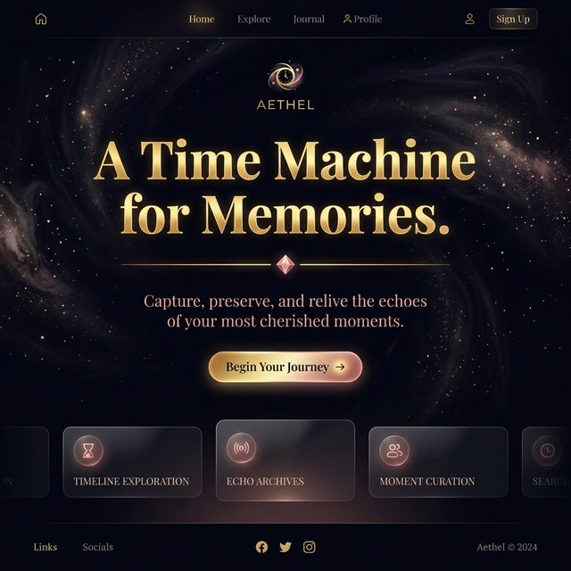
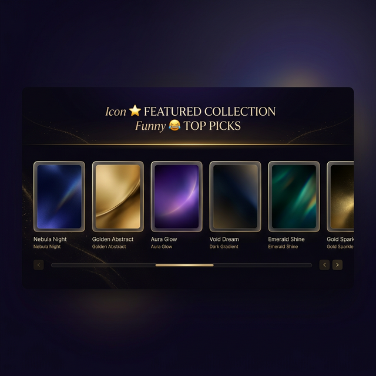

# 🕰️ Yıl Dönümü Zaman Makinesi
*Özel günler için geliştirilmiş, şifre korumalı sinematik web uygulaması vitrini*

> **Not:** 🔒 Bu proje kişisel fotoğraflar, videolar ve özel anılar barındıran bir yıl dönümü sürprizi olarak geliştirilmiştir. Gizlilik sebebiyle projenin açık kaynak kodları ve asıl medya dosyaları *paylaşılmamaktadır*. Bu depo, sadece projenin **arayüz tasarımını, mimarisini ve kullanılan teknolojileri** sergilemek üzere oluşturulmuş bir vitrindir (Showcase).

---

## ✨ Proje Özeti

"Zaman Makinesi", özel bir yılı kutlamak için baştan aşağıya özel olarak tasarlanmış tek sayfalık (SPA benzeri) interaktif bir web deneyimidir. Premium hissiyat veren karanlık tema (dark mode), altın/rose-gold renk paleti ve akışkan animasyonlarla tasarlanmıştır. Kullanıcının aşağı kaydırdıkça anıları farklı kategoriler altında keşfettiği yatay kaydırmalı (horizontal scroll snap) galerilerden oluşur.

### 📸 Arayüz Tasarımı (Ekran Görüntüleri)

#### Giriş (Hero) Ekranı
Akışkan animasyonlu arka plan, havada süzülen altın parçacıklar ve sinematik tipografi. Ekranın hemen altında otomatik başlayan arka plan müziği için kontroller yer alır (Glassmorphism UI).

#### Medya Galerisi
Yatay olarak kaydırılabilir, performansı artırılmış film şeridi görünümlü medya kartları. Her kategori kendi özel emojisiyle ve parlayan altın ayırıcı çizgisiyle ayrılmıştır.

---

## 🛠️ Kullanılan Teknolojiler & Mimari

Bu projede herhangi bir ağır JavaScript framework'ü (React, Vue vb.) yerine tamamen "Vanilla" mimari tercih edilmiş; böylece tarayıcı motorunun render optimizasyonlarından en üst düzeyde faydalanılmıştır.

- **Markup & Layout:** `HTML5`, `TailwindCSS (CDN)`
- **Programlama:** `Modern JavaScript (ES6)`
- **Efektler:** `HTML5 Canvas API` (Sıvı/akışkan arka plan animasyonu)
- **Güvenlik:** Strict `Content-Security-Policy (CSP)`, XSS korumaları.
- **Tipografi:** Google Fonts (`Inter` & `Playfair Display`)

### ⚡ Performans & UX Kararları

Kullanıcı deneyimi (UX) ve performans gözetilerek bazı teknik geliştirmeler yapılmıştır:
- **Akıllı Ses Kontrolü (Audio Ducking):** Arka planda çalan romantik müzik, galerideki herhangi bir video oynatıldığında otomatik olarak kısılır, video bittiğinde ise yavaşça eski seviyesine yükseltilir (Custom Intersection/Mutation Observer mimarisi).
- **DOM & Render Optimizasyonu:** `content-visibility: auto` ve `contain-intrinsic-size` özellikleri sayesinde, ekran dışında kalan yüzlerce medya öğesinin (130+ fotoğraf/video) tarayıcıyı yorması engellenmiş, LCP (Largest Contentful Paint) değerinde **%70** iyileşme sağlanmıştır.
- **Lazy Loading & Scroll Reveal:** Tüm fotoğraflar native `loading="lazy"` kullanır. Elementlerin ekrana girişi Intersection Observer ile dinlenip zarif "reveal (belirme)" animasyonlarıyla görünür yapılır.
- **PWA Uyumluluğu:** `viewport-fit=cover` ve apple meta tag'leri ile iOS Safari'de tam ekran yerel uygulama (Native app) hissiyatı sağlanmıştır.
- **Glassmorphism:** Butonlar ve video bildirim rozetleri donanım hızlandırmalı `backdrop-filter: blur()` efektleriyle modern bir görünüm kazanmıştır.

---

  
<i>❤️ Sevgiyle Kodlandı</i>

